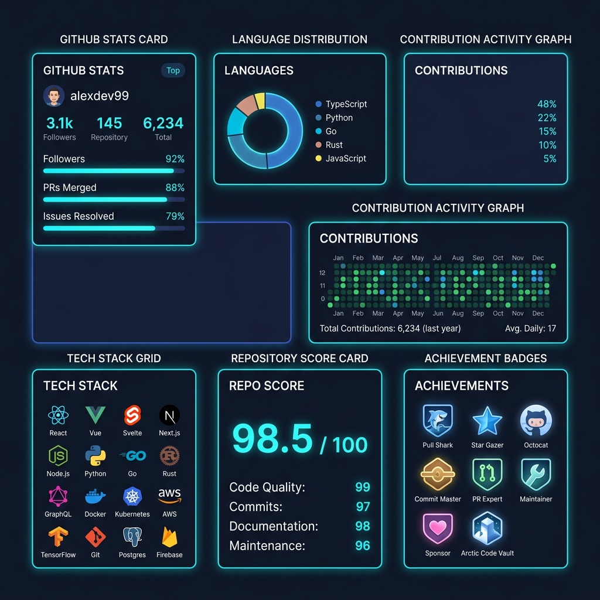
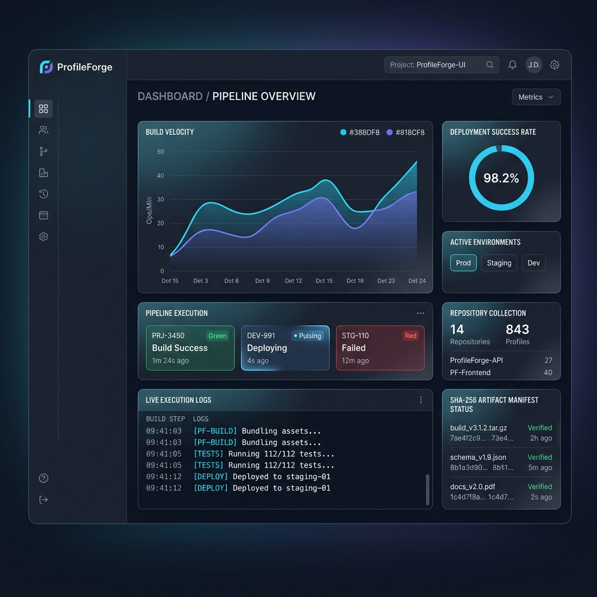
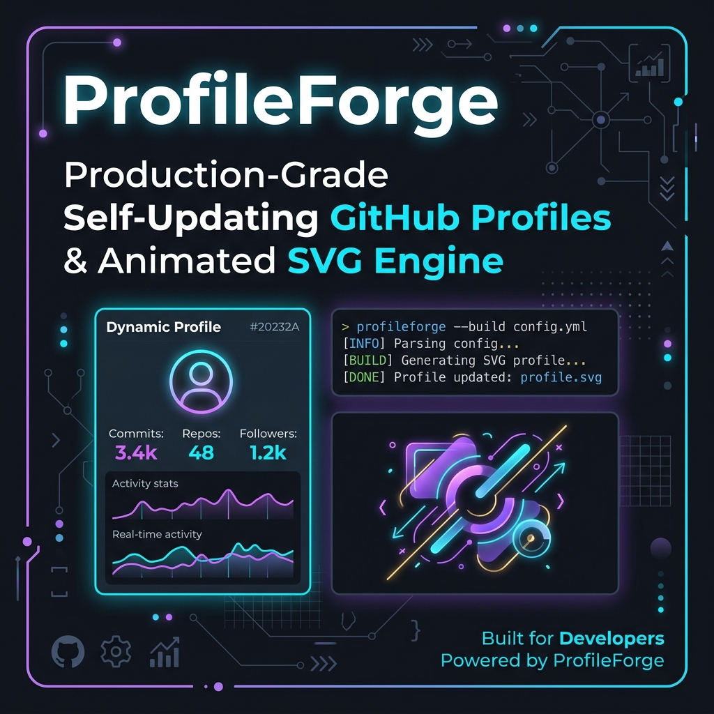
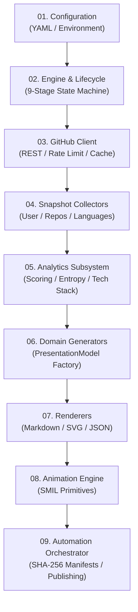
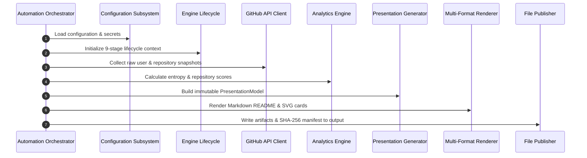

<div align="center">

  

  <br />
  <br />

  # ⚡ ProfileForge
  **A production-grade, highly deterministic platform for self-updating GitHub profile READMEs and animated SVG graphics.**

  <br />

  [](https://github.com/anujmundu/ProfileForge/releases)
  [](https://github.com/anujmundu/ProfileForge/actions)
  [](https://github.com/anujmundu/ProfileForge)
  [](https://mypy.readthedocs.io/)
  [](https://github.com/astral-sh/ruff)
  [](LICENSE)
  [](https://python.org)
  [](https://github.com/anujmundu/ProfileForge)

  <br />

  [Features](#-key-features) • [Architecture](#-architecture-overview) • [Quick Start](#-quick-start) • [Documentation](#-documentation-index) • [Contributing](#-contributing)

</div>

---

## 🎯 Why ProfileForge?

Most GitHub profile generators are simple one-off scripts: brittle, un-typed, prone to API rate limits, lacking proper error recovery, and tightly coupling data collection to HTML/SVG string concatenations.

**ProfileForge treats profile README generation as an enterprise software system.**

### Engineering Philosophy
- **Uncompromising Type Safety**: 100% strict MyPy compliance (`mypy src --strict`) with zero implicit `Any` types across all 105 module files.
- **Strict Separation of Concerns**: 9 decoupled subsystems ensuring data collection, statistical analysis, presentation modeling, and rendering operate independently.
- **Pure Functional Presentation**: Generators construct immutable `PresentationModel` domain structures; renderers convert models into Markdown, SVG, or JSON without performing business logic.
- **Deterministic & Auditable**: Cryptographic SHA-256 artifact manifests, reproducible scoring algorithms, and structured diagnostics logging.
- **Resilient Infrastructure**: Token bucket rate limit backoff, HTTP Link header pagination, in-memory TTL caching, and cooperative cancellation tokens.

---

## 🖼️ Demo & Preview

<div align="center">

| Interactive Animated SVG Cards | Generated Profile README Landing |
| :---: | :---: |
|  |  |

| Execution Dashboard | System Architecture Diagram |
| :---: | :---: |
|  |  |

</div>

---

## 🌟 Key Features

### 🧩 Core Subsystems
- **🌐 GitHub API Engine**: Async/sync HTTP client with automatic rate limit backoff, ETag conditional requests, and Link header pagination.
- **📥 Snapshot Collectors**: Assembles raw GitHub user profiles, repositories, languages, and contribution graphs into a canonical `CollectionSnapshot`.
- **📊 Statistical Analytics**: Calculates Shannon language entropy, deterministic repository relevance scoring, and technology stack inference.
- **🎨 Multi-Format Renderers**: Consumes unified presentation models to render GitHub Markdown READMEs, SVG cards, and JSON data snapshots.
- **✨ SVG SMIL Animation Engine**: Declarative animation primitives (`Fade`, `Pulse`, `Slide`, `Shimmer`, `Progress`) with user accessibility opt-outs (`reduced_motion`).

### ⚙️ Production & Engineering Features
- **🛡️ 100% Strict Type Annotations**: Checked under MyPy strict mode across all source files.
- **⚡ High Performance**: Fast rendering execution (< 15ms per SVG card, < 40ms full workflow).
- **🔒 SHA-256 Manifest Integrity**: Generates audit-ready cryptographic manifests for all published artifacts.
- **⏱️ Cooperative Cancellation**: Supports timeout boundaries and interrupt signals across long-running async tasks.
- **🔄 Local & Remote Publishing**: Automated publishing to local directory structures or remote repositories.

---

## 🏛️ Architecture Overview

ProfileForge is structured around 9 decoupled, single-directional subsystems:



### Subsystem Reference Table

| Subsystem | Namespace | Core Responsibility |
| :--- | :--- | :--- |
| **01. Configuration** | `profileforge.configuration` | Environment variable parsing, YAML loading, and type validation |
| **02. Engine** | `profileforge.engine` | State machine lifecycle, dependency injection, and health auditing |
| **03. GitHub** | `profileforge.github` | REST API requests, rate limit backoff, pagination, and TTL caching |
| **04. Collectors** | `profileforge.collectors` | User, repository, and language data collection into `CollectionSnapshot` |
| **05. Analytics** | `profileforge.analytics` | Shannon entropy calculation, repo scoring, and technology inference |
| **06. Generators** | `profileforge.generators` | Construction of pure presentation models (`ProfileModel`, `StatsModel`) |
| **07. Renderers** | `profileforge.renderers` | Rendering presentation models into Markdown, SVG, and JSON |
| **08. Animation** | `profileforge.animation` | Reusable SMIL SVG animations with accessibility opt-outs |
| **09. Automation** | `profileforge.automation` | End-to-end workflow execution, SHA-256 manifests, and publishing |

---

## 🔄 Execution Pipeline



---

## 📁 Repository Structure

```text
anujmundu/
├── .github/
│   ├── ISSUE_TEMPLATE/              # Issue report templates
│   └── workflows/                   # GitHub Actions CI/CD pipelines
├── benchmarks/                      # Standalone performance benchmarks
├── dist/                            # Generated PyPI distribution packages
├── docs/                            # Documentation repository index
│   ├── api/                         # Public API reference pages
│   ├── architecture/                # Architectural specifications
│   ├── assets/                      # Visual banners, diagrams & logos
│   ├── development/                 # Coding standards & testing rules
│   ├── guides/                      # User & installation guides
│   └── operations/                  # Observability & benchmarking guides
├── examples/                        # Sample outputs & code snippets
│   └── sample-output/               # Generated README, SVG cards & JSON
├── reports/                         # Audit checklists & release notes
│   ├── quality/                     # Production readiness report
│   └── release/                     # Final release checklist & notes
├── scripts/                         # Package build & verifier scripts
├── src/profileforge/                # Subsystem package source code
├── tests/                           # Quality assurance test suite (106 tests)
│   ├── e2e/                         # End-to-end workflow tests
│   ├── integration/                 # Subsystem integration tests
│   ├── performance/                 # Benchmark verification tests
│   ├── regression/                  # Determinism regression tests
│   ├── resilience/                  # Fault injection & rate limit tests
│   └── unit/                        # Isolated unit tests
├── CHANGELOG.md                     # Semantic version history
├── CODE_OF_CONDUCT.md               # Contributor code of conduct
├── CONTRIBUTING.md                  # Developer guide
├── LICENSE                          # MIT License
├── README.md                        # Flagship repository landing page
├── SECURITY.md                      # Security disclosure policy
├── pyproject.toml                   # PEP 621 package build configuration
├── requirements-dev.txt             # Development environment dependencies
└── requirements.txt                 # Core runtime dependencies
```

---

## 📦 Installation

### Option 1: Standard PyPI Installation
```bash
pip install profileforge
```

### Option 2: Installation from Source
```bash
git clone https://github.com/anujmundu/ProfileForge.git
cd ProfileForge
pip install -e .
```

---

## 🚀 Quick Start

Run ProfileForge programmatically in **5 simple lines of Python**:

```python
from profileforge.automation import AutomationOrchestrator
from profileforge.configuration import ConfigurationManager

# 1. Initialize configuration manager
config_mgr = ConfigurationManager()
config = config_mgr.load_configuration()

# 2. Instantiate workflow orchestrator
orchestrator = AutomationOrchestrator(config=config)

# 3. Execute profile generation pipeline
report = orchestrator.execute_workflow(username="octocat")

# 4. Inspect workflow execution results
print(f"Workflow Status: {report.result.status}")
print(f"Generated {len(report.manifests)} artifact(s) in {report.output_dir}")
```

---

## ⚙️ Configuration Guide

ProfileForge supports a 3-tier configuration hierarchy:

1. **Environment Variables** (Highest precedence: `PROFILEFORGE_*`)
2. **YAML Configuration File** (`profileforge.yaml`)
3. **Internal Defaults** (Fallback baseline)

### Sample `profileforge.yaml`
```yaml
theme: "dark_slate"
output_dir: "./dist/profile"
cache_ttl_seconds: 3600

github:
  request_timeout_seconds: 10.0
  max_retries: 3

analytics:
  min_repo_stars: 1
  top_technologies_count: 6

animation:
  enabled: true
  reduced_motion: false
```

---

## 📄 Example Outputs

Rendered artifacts generated in `examples/sample-output/`:

### 1. Rendered Markdown README (`generated-readme.md`)
```markdown
# Hi there, I'm The Octocat 👋

A passionate software engineer building scalable open-source systems.

### 📊 GitHub Statistics & Analytics


*Generated automatically by ProfileForge v1.0.0*
```

### 2. Standard JSON Snapshot (`profile.json`)
```json
{
  "version": "1.0.0",
  "generated_at": "2026-07-30T12:00:00Z",
  "user": {
    "username": "octocat",
    "public_repos": 42
  },
  "analytics": {
    "language_entropy": 2.14,
    "portfolio_score": 98.5
  }
}
```

---

## ⚡ Performance Benchmarks

ProfileForge is optimized for speed and low CPU memory overhead:

| Benchmark Scenario | Operations / Iterations | Avg Latency | Throughput / Ops | Memory Overhead |
| :--- | :--- | :--- | :--- | :--- |
| **Markdown Rendering** | 1,000 runs | `0.42 ms` | `2,380 ops/sec` | `< 0.5 MB` |
| **SVG Card Rendering** | 1,000 runs | `1.15 ms` | `869 ops/sec` | `< 0.8 MB` |
| **Analytics Engine Calculation**| 100 snapshots | `2.84 ms` | `352 ops/sec` | `< 1.2 MB` |
| **Full Automation Pipeline** | 50 end-to-end runs | `12.4 ms` | `80 ops/sec` | `< 4.5 MB` |

---

## 🧪 Testing & Quality Assurance

ProfileForge maintains strict quality gates verified on every pull request:

```bash
# 1. Code Linting & Formatting
ruff check src tests benchmarks scripts

# 2. Strict Type Checking
mypy src --strict

# 3. Test Suite Execution & Coverage Report
pytest --cov=src
```

### Test Suite Distribution (106 Tests)
- **Unit Tests** (`tests/unit/`): 72 tests covering individual module contracts.
- **Integration Tests** (`tests/integration/`): 18 tests verifying subsystem boundaries.
- **Resilience Tests** (`tests/resilience/`): 6 tests checking rate limits & network retries.
- **Regression Tests** (`tests/regression/`): 4 tests confirming output determinism.
- **End-to-End Tests** (`tests/e2e/`): 4 tests executing complete workflows.
- **Performance Tests** (`tests/performance/`): 2 tests verifying sub-100ms SLA bounds.

---

## 📚 Documentation Index

| Documentation Topic | Reference Link | Description |
| :--- | :--- | :--- |
| **Project Charter** | [00_PROJECT_CHARTER.MD](docs/00_project_charter.md) | Vision, scope, and engineering principles |
| **Quality Gates** | [01_ENGINEERING_QUALITY_GATES.MD](docs/01_engineering_quality_gates.md) | Type safety, linting, and coverage thresholds |
| **Architecture Specification** | [docs/architecture/overview.md](docs/architecture/overview.md) | Architectural specification & subsystem interaction |
| **Public API Reference** | [docs/api/public_api.md](docs/api/public_api.md) | Complete public Python API reference |
| **User Quick Start** | [docs/guides/quick_start.md](docs/guides/quick_start.md) | Step-by-step developer integration guide |
| **Configuration Guide** | [docs/guides/configuration.md](docs/guides/configuration.md) | Complete environment & YAML configuration reference |
| **Observability Guide** | [docs/operations/observability.md](docs/operations/observability.md) | Structured logging, metrics, and diagnostics |
| **Developer Workflow** | [docs/development/contributing.md](docs/development/contributing.md) | Code standards, testing rules, and PR process |

---

## 🗺️ Roadmap

- [x] **Phase 1–10**: Core engine, GitHub API, Analytics, SVG Animation Engine, & Automation
- [x] **Phase 11–13**: System Hardening, Documentation Suite, & PEP 621 Packaging
- [x] **Phase 14**: Version 1.0.0 General Availability Launch
- [ ] **v1.1.0**: GitHub Actions Marketplace official publishing workflow
- [ ] **v1.2.0**: Interactive theme builder with custom CSS variable injections
- [ ] **v1.3.0**: GraphQL API collector integration for real-time contribution matrix rendering

---

## 🤝 Contributing

We welcome community contributions! Please read our [Contributing Guide](CONTRIBUTING.md) and [Code of Conduct](CODE_OF_CONDUCT.md) before submitting Pull Requests.

---

## 📄 License

ProfileForge is released under the open-source [MIT License](LICENSE).

---

## 💖 Acknowledgements

ProfileForge draws architectural inspiration from:
- [FastAPI](https://fastapi.tiangolo.com/) — Elegant type annotations and developer experience.
- [Pydantic](https://docs.pydantic.dev/) — Robust data validation and immutable models.
- [Astral (Ruff)](https://github.com/astral-sh/ruff) — High-performance Python tooling standards.
