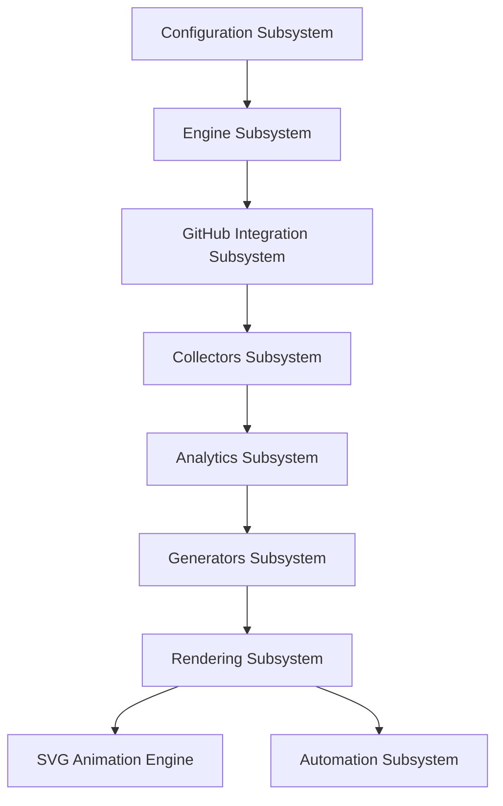

# System Architecture Overview

ProfileForge is organized into 9 decoupled subsystems. Each subsystem has a single responsibility and clean interfaces.

---

## Subsystem Architecture Diagram

---

## Subsystem Responsibilities

1. **Configuration (`profileforge.configuration`)**: Validates YAML configuration files and environment variable overrides (`PROFILEFORGE_*`).
2. **Engine (`profileforge.engine`)**: Manages application lifecycle phases (`BOOTSTRAPPING`, `READY`, `RUNNING`, `SHUTTING_DOWN`), dependency injection, and health auditing.
3. **GitHub Integration (`profileforge.github`)**: Low-level REST API client handling rate limits, HTTP Link header pagination, and response caching.
4. **Collectors (`profileforge.collectors`)**: Assembles raw GitHub user, repository, language, and contribution data into canonical `CollectionSnapshot` objects.
5. **Analytics (`profileforge.analytics`)**: Deterministic repository scoring, Shannon language entropy calculation, and technology stack inference.
6. **Generators (`profileforge.generators`)**: Produces presentation-independent domain models (`PresentationModel`) containing profile, statistics, tech stack, and timeline data.
7. **Renderers (`profileforge.renderers`)**: Transforms presentation models into concrete output artifacts (`MarkdownArtifact`, `SVGArtifact`, `JSONArtifact`).
8. **Animation Engine (`profileforge.animation`)**: Reusable SMIL SVG animation primitives (`Fade`, `Pulse`, `Slide`, `Shimmer`, `Progress`) with accessibility opt-out.
9. **Automation (`profileforge.automation`)**: Master workflow orchestration (`Workflow`), SHA-256 artifact manifest generation (`ArtifactManager`), retry policies, cooperative cancellation, and publishing.
